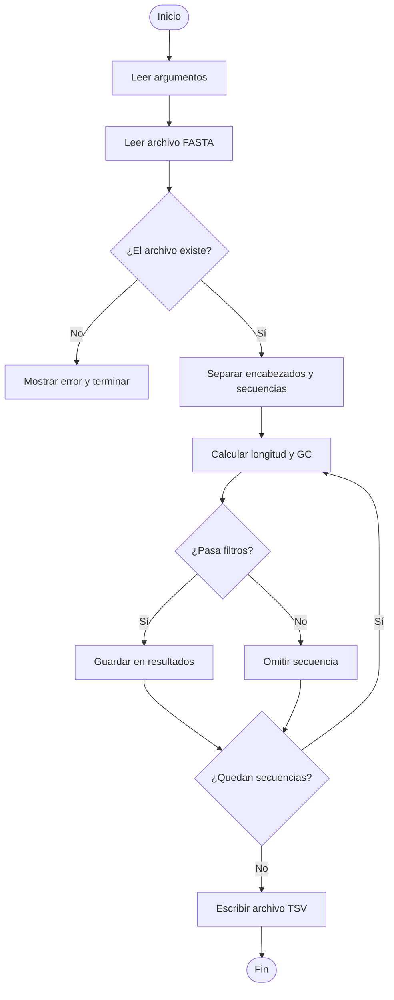

# Diseño del Analizador de Secuencias FASTA

## Objetivo del diseño

Este documento describe cómo se organizará el programa antes de escribir el código.

La idea principal es dividir el problema en partes pequeñas. Cada parte tendrá una responsabilidad clara.

